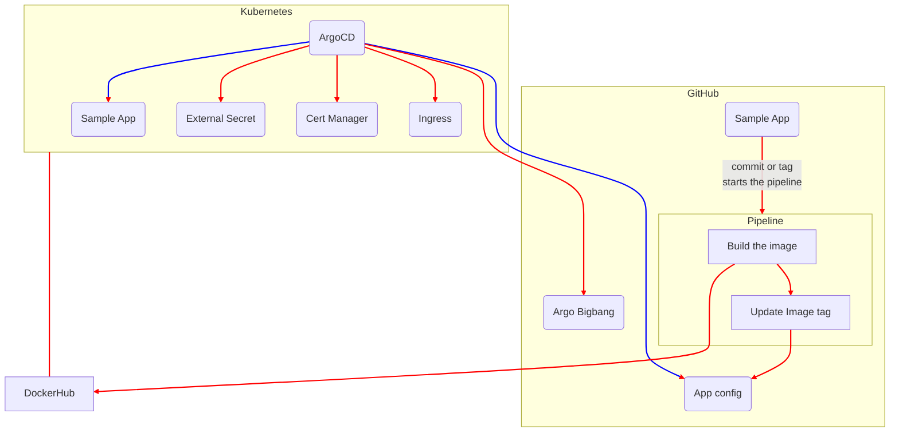

# Argo Universe


Argo Universe is a comprehensive Kubernetes resource boilerplate consisting of multiple repositories. Our primary goal is to share our expertise and experience with the community by providing a Kubernetes stack example using only ArgoCD. This is a sample GitOps methodology that offers all the necessary components in a few simple steps.

We have developed a collection of repositories, known as Argo Universe, to serve as a starting point for individuals interested in GitOps, ArgoCD, or Kubernetes. It features an ArgoCD boilerplate that can be utilized as a reference or launchpad.

Furthermore, we have supplementary repositories that store example app and application configurations. These repositories offer a sample workflow for constructing and deploying an application.

# Taka a look at  LIVE ArgoCD installation from here https://argocd.argouniverse.com/


## Getting Started

To get started with Argo Universe, simply check out our [Argo Bigbang repo](https://github.com/argo-universe/argo-bigbang). Feel free to explore and use the repositories as you see fit.



## Installation

Clone the  [Argo Bigbang](https://github.com/argo-universe/argo-bigbang) run install.sh file with environment name

```bash

$ git clone https://github.com/argo-universe/argo-bigbang.git
$ cd argo-bigbang 
# this will install argocd and bigbang app then bigbang app will install  cluster addons and sample app
$ ./install.sh dev
```


## Contributing

We welcome contributions from anyone who is interested in GitOps, ArgoCD, or Kubernetes. You can contribute to Argo Universe by submitting pull requests, opening issues, or sharing your thoughts and ideas.

We believe that by collaborating with others, we can improve and expand our knowledge and share it with the world.

## License

Argo Universe is released under the [Apache License 2.0](LICENSE.md). 

--- 
