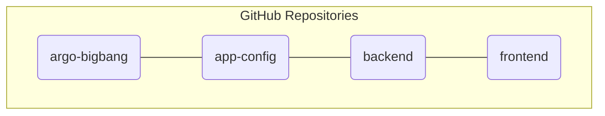
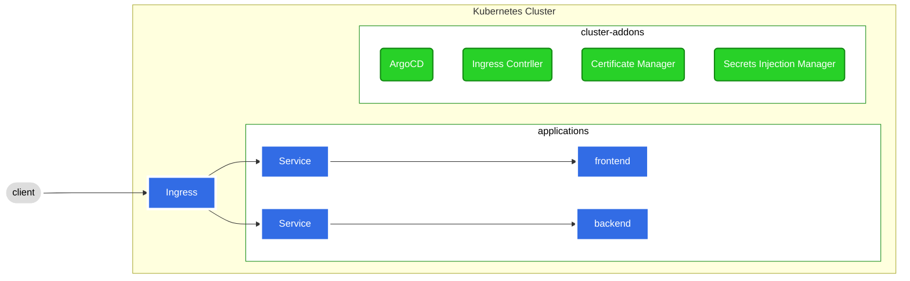

# What is Argo Universe?
Definition of the project, purpose etc... boilerplate, education portal, guideline, design pattern

>Design patterns are reusable solutions and best practices for designing, building, and managing platform systems. They provide a common language and approach for solving common problems in platform development and management, such as architectural patterns, deployment patterns, scaling patterns, and operational patterns. By using design patterns, platform teams can benefit from proven solutions and best practices, leading to more efficient and reliable development and management of platform systems.

    
Argo Universe is a comprehensive Kubernetes resource boilerplate consisting of multiple repositories. Our primary goal is to share our expertise and experience with the community by providing a Kubernetes stack example using only ArgoCD. This is a sample GitOps methodology that offers all the necessary components in a few simple steps.

We have developed a collection of repositories, known as Argo Universe, to serve as a starting point for individuals interested in GitOps, ArgoCD, or Kubernetes. It features an ArgoCD boilerplate that can be utilized as a reference or launchpad.

Furthermore, we have supplementary repositories that store example app and application configurations. These repositories offer a sample workflow for constructing and deploying an application.

## Getting Started
 
### Cloud Resources
could be basic terraform template, 

?? requirements for local environment ?? Kd3/ minicube

### Kubernetes Stack

To get started with Argo Universe, simply check out our [Argo Bigbang repo](https://github.com/argo-universe/argo-bigbang). Feel free to explore and use the repositories as you see fit.

### Cluster Addons

What are they? why we need it? what componenets are required for an ideal kubernetes cluster?

##### ArgoCD
ArgoCD is a continuous delivery tool that automates the deployment of applications to Kubernetes clusters. It is used in Kubernetes to streamline the deployment process by providing a unified interface for managing deployment configurations and deployment targets.

#### Ingress  
Nginx ingress controller is a Kubernetes-native solution for managing incoming traffic to a cluster. It is used in Kubernetes to route incoming traffic to the appropriate application and to provide load balancing and SSL termination.

##### Secret Manager 
External secret store is a Kubernetes tool that allows for the management of secrets in an external, secure location outside of Kubernetes. It is used in Kubernetes to improve security by separating secret management from the main cluster and providing access control and auditing capabilities.

##### Certificate Manager 
Cert manager is a Kubernetes tool for automatically managing SSL/TLS certificates for Kubernetes workloads. It is used in Kubernetes to simplify the process of managing certificates and to ensure that workloads are always securely encrypted.

## Contributing

We welcome contributions from anyone who is interested in GitOps, ArgoCD, or Kubernetes. You can contribute to Argo Universe by submitting pull requests, opening issues, or sharing your thoughts and ideas.

We believe that by collaborating with others, we can improve and expand our knowledge and share it with the world.

## License

Argo Universe is released under the [Apache License 2.0](LICENSE.md). 

--- 
